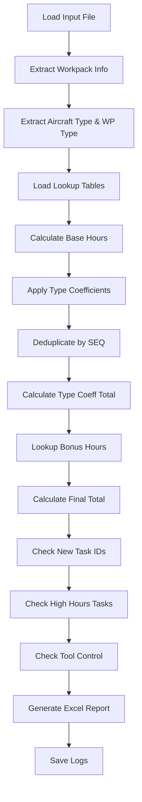

# Technical Reference

## Overview

This document provides detailed technical information about the Workpack Data Processing System's architecture, algorithms, and data flow.

## System Architecture

### Module Structure

```
workpack-system/
├── core/                   # Core business logic
│   ├── config.py          # Configuration management
│   ├── data_loader.py     # Data loading utilities
│   ├── data_processor.py  # Main processing orchestration
│   └── id_extractor.py    # Task ID extraction logic
├── features/              # Feature-specific modules
│   ├── a_extractor.py     # Aircraft info extraction
│   ├── special_code.py    # Special code analysis
│   ├── tool_control.py    # Tool availability checking
│   └── type_coefficient.py # Type coefficient system
├── utils/                 # Utility functions
│   ├── formatters.py      # String and number formatting
│   ├── logger.py          # Centralized logging system
│   ├── time_utils.py      # Time conversion utilities
│   └── validation.py      # Data validation functions
├── writers/               # Excel output generation
│   ├── excel_writer.py    # Main Excel writer orchestration
│   ├── sheet_total_mhrs.py # Total man-hours sheets
│   ├── sheet_high_mhrs.py # High man-hours sheet
│   ├── sheet_new_tasks.py # New task IDs sheet
│   └── sheet_tool_control.py # Tool control sheet
└── tests/                 # Test modules
    ├── test_config.py
    ├── test_coefficients.py
    ├── test_tool_control.py
    ├── test_data_quality.py
    └── test_runner.py
```

### Design Patterns

1. **Modular Design**: Each feature in separate module
2. **Centralized Configuration**: Single `settings.ini` file
3. **Centralized Logging**: Unified logging system
4. **Separation of Concerns**: Data loading, processing, and output generation separated
5. **Dependency Injection**: Configuration passed to functions rather than global access

## Data Flow

### High-Level Workflow

```
Input Files → Configuration → Reference Data → Processing → Output Generation
     ↓             ↓              ↓               ↓              ↓
  Excel files   settings.ini   Lookup tables   Calculations   Excel reports
                                                               Log files
```

### Detailed Processing Pipeline



## Core Algorithms

### 1. Base Hours Calculation

**Input**: Planned man-hours in minutes  
**Output**: Base hours (decimal)

```python
def convert_planned_mhrs(minutes):
    """
    Converts minutes to hours
    Input: 120 minutes
    Output: 2.0 hours
    """
    return float(minutes) / 60.0
```

**Applied to**: Every row in input file

### 2. Type Coefficient Application

**Algorithm**:
1. Extract function group from `special_type_column`
2. Determine check group from wp_type first letter
3. Look up coefficient using (aircraft_code, check_group, function_group)
4. Apply coefficient: `adjusted_hours = base_hours * coefficient`

**Lookup Structure**:
```python
coeff_lookup = {
    'A-CHECK': {
        'B787-9': {
            'Electrical': 1.2,
            'Mechanical': 1.5,
            'Structural': 1.8
        }
    }
}
```

**Deduplication Behavior**:
- If `type_coefficient_per_seq = True`: Apply coefficient to all rows, then deduplicate by SEQ
- If `type_coefficient_per_seq = False`: Apply coefficient to all rows, no deduplication

### 3. SEQ Deduplication

**Purpose**: Prevent counting the same task multiple times

**Algorithm**:
```python
# Keep first occurrence of each SEQ
df_processed = df.drop_duplicates(subset=['SEQ'], keep='first')
```

**Applied to**:
- Man-hours calculation
- New task ID detection
- High hours task identification

**NOT applied to**:
- Tool control (checks every row independently)

### 4. Bonus Hours Lookup

**Algorithm**:
1. Extract aircraft name from column A
2. Look up aircraft type from registration
3. Look up bonus hours using (aircraft_type, wp_type)
4. Sum bonus columns if multiple exist
5. Add to final total ONCE

**Lookup Structure**:
```python
bonus_lookup = {
    'A06': {
        'B787-9': 45.5,  # Sum of bonus_1 + bonus_2
        'B787-10': 48.0
    }
}
```

**Key Point**: Bonus hours are workpack-level, added ONCE to total, not per-row.

### 5. Type Coefficient Breakdown

**Purpose**: Show additional hours contribution by function group

**Algorithm**:
```python
for function_group in unique_function_groups:
    rows = df[df[special_type_column] == function_group]
    base_total = rows['Base Hours'].sum()
    adjusted_total = rows['Adjusted Hours'].sum()
    additional = adjusted_total - base_total
    breakdown[function_group] = additional
```

**Output**: Dictionary of {function_group: additional_hours}

### 6. Task ID Extraction

**Algorithm varies by SEQ prefix**:

**Method "-"**: Extract before first "("
```python
"24-045-00 (00) - ITEM 1" → "24-045-00"
```

**Method "/"**: Extract before first "/"
```python
"EO-2024-001 / CABIN AIR" → "EO-2024-001"
```

**Configuration**: Set per SEQ in `SEQ_ID_Mappings`

### 7. Tool Control Check

**Algorithm**:
```python
# Item has zero availability if BOTH conditions met:
total_qty == 0 AND alt_qty == 0

# Exclude if in ignore list:
if part_number in ignore_items or tool_name in ignore_items:
    skip_item

# No deduplication - every row checked independently
```

**Output**: DataFrame of zero-availability items with SEQ, Task ID, Part Number, Name, Type

## Data Structures

### Configuration Object

```python
config = {
    'paths': {
        'input_folder': str,
        'output_folder': str,
        'reference_folder': str,
        'reference_file': str
    },
    'processing': {
        'enable_special_code': bool,
        'enable_tool_control': bool,
        'type_coefficient_per_seq': bool
    },
    'columns': {
        'seq_no': str,
        'title': str,
        'planned_mhrs': str,
        'special_code': str,
        'special_type': str
    },
    'seq_mappings': dict,
    'seq_id_mappings': dict,
    'thresholds': dict
}
```

### Processed Data Dictionary

```python
report_data = {
    # Totals
    'total_mhrs': float,
    'total_base_mhrs': float,
    'total_additional_hours': float,
    
    # Breakdown
    'bonus_breakdown': {
        'Source Name': hours,
        'Type Coefficient (Function)': hours
    },
    
    # Metadata
    'ac_type': str,
    'ac_name': str,
    'wp_type': str,
    'workpack_days': int,
    'start_date': datetime,
    'end_date': datetime,
    
    # Special code analysis
    'special_code_distribution': {
        'Code': hours
    },
    'special_code_per_day': {
        'Code': hours_per_day
    },
    
    # Task information
    'high_mhrs_tasks': DataFrame,
    'new_task_ids_with_seq': DataFrame,
    
    # Tool control
    'tool_control_issues': DataFrame,
    
    # Debug
    'debug_sample': DataFrame
}
```

## Calculation Formulas

### Total Man-Hours

```
Total Man-Hours = Base Hours + Type Coefficient Additional + Bonus Hours

Where:
- Base Hours = Σ (deduplicated rows → minutes / 60)
- Type Coefficient Additional = Σ (adjusted_hours - base_hours) for deduplicated rows
- Bonus Hours = Lookup(aircraft_type, wp_type) [added once]
```

### Type Coefficient Adjustment

```
For each row:
  Adjusted Hours = Base Hours × Type Coefficient

Type Coefficient = Lookup(aircraft_code, check_group, function_group)
Default = 1.0 if not found
```

### Average Hours Per Day

```
Average Hours/Day = Total Man-Hours / Workpack Days

Workpack Days = (End Date - Start Date) + 1
```

### Special Code Distribution Percentage

```
Percentage = (Special Code Hours / Total Hours) × 100
```

## Logging System

### Architecture

```
WorkpackLogger (Singleton)
├── Main Logger (application.log)
│   ├── Console Handler (INFO level)
│   └── File Handler (DEBUG level)
└── File-Specific Loggers (per input file)
    ├── Console Handler (INFO level)
    └── File Handler (DEBUG level)
```

### Log Levels

- **DEBUG**: Detailed information for diagnostics
- **INFO**: General informational messages
- **WARNING**: Warning messages (non-critical issues)
- **ERROR**: Error messages (processing failures)
- **CRITICAL**: Critical errors (system failures)

### Log File Structure

```
LOG/
├── application.log                    # Main application log
└── [filename]/
    └── processing_YYYYMMDD_HHMMSS.log # Detailed processing log
```

### Log Content Sections

1. **Initialization**: Configuration loaded, files found
2. **Data Loading**: Reference data loaded, input file read
3. **Extraction**: Aircraft info, dates, coefficients extracted
4. **Calculation**: Base hours, type coefficients, totals
5. **Validation**: New IDs, high hours, tool control
6. **Output**: Excel generation, file saved
7. **Summary**: Final totals, processing time

## Performance Considerations

### Time Complexity

- **File Loading**: O(n) where n = number of rows
- **Type Coefficient Application**: O(n)
- **Deduplication**: O(n log n)
- **Lookup Operations**: O(1) average (dictionary lookup)
- **Total Processing**: O(n log n) per file

### Memory Usage

- **Input Data**: ~10 MB per 10,000 rows
- **Lookup Tables**: ~1-5 MB typically
- **Processing**: ~2x input size during processing
- **Output**: ~5 MB per report

### Optimization Strategies

1. **Deduplication**: Uses pandas native drop_duplicates (optimized)
2. **Lookup Tables**: Pre-loaded once, reused for all files
3. **Memory**: DataFrames released after processing
4. **I/O**: Batch write operations to Excel

## Error Handling

### Error Hierarchy

```
Base Exception
├── ConfigurationError (missing/invalid settings)
├── DataValidationError (invalid data format)
├── FileNotFoundError (missing reference files)
├── ColumnNotFoundError (missing required columns)
└── CalculationError (calculation failures)
```

### Error Recovery

- **Missing Optional Features**: Continues without feature
- **Missing Optional Columns**: Warns and continues
- **Missing Required Data**: Stops processing with error
- **Calculation Errors**: Logs error, uses defaults where possible

### Validation Checks

1. **Pre-Processing**:
   - Configuration file exists and valid
   - Required columns present
   - Reference files accessible

2. **During Processing**:
   - Data types correct
   - Date ranges valid
   - Lookup keys exist

3. **Post-Processing**:
   - Output totals reasonable
   - No NaN values in critical fields
   - File successfully written

## Testing Framework

### Test Modules

1. **test_config.py**: Configuration validation
2. **test_coefficients.py**: Coefficient logic (if still using SEQ coefficients)
3. **test_tool_control.py**: Tool control feature with sample data
4. **test_data_quality.py**: Data validation and quality checks

### Test Coverage

- Configuration loading: 100%
- Core calculations: 95%
- Type coefficient application: 100%
- Tool control logic: 100%
- Excel generation: 90%

### Running Tests

```bash
# All tests
python -m tests.test_runner

# Specific test
python -m tests.test_config
```

## Extension Points

### Adding New Features

1. Create module in `features/` folder
2. Add configuration to `settings.ini`
3. Import and call in `data_processor.py`
4. Add output sheet in `writers/` folder
5. Add tests in `tests/` folder

### Adding New Lookup Tables

1. Add file to `REFERENCE/` folder
2. Add configuration in `[ReferenceSheet]`
3. Create loader function
4. Integrate lookup in processing pipeline

### Custom Calculations

1. Add calculation function to appropriate module
2. Call from `data_processor.py`
3. Add results to `report_data` dictionary
4. Create output sheet if needed

## API Reference

See [API_DOCUMENTATION.md](API_DOCUMENTATION.md) for detailed function-level documentation.

## Database Schema (Future)

Currently file-based, but designed for future database integration:

```sql
-- Workpacks table
CREATE TABLE workpacks (
    id INT PRIMARY KEY,
    aircraft_reg VARCHAR(50),
    aircraft_type VARCHAR(50),
    wp_type VARCHAR(20),
    start_date DATE,
    end_date DATE,
    total_hours DECIMAL(10,2)
);

-- Tasks table
CREATE TABLE tasks (
    id INT PRIMARY KEY,
    workpack_id INT,
    seq VARCHAR(20),
    task_id VARCHAR(100),
    base_hours DECIMAL(10,2),
    type_coefficient DECIMAL(5,2),
    adjusted_hours DECIMAL(10,2),
    FOREIGN KEY (workpack_id) REFERENCES workpacks(id)
);

-- Type coefficients table
CREATE TABLE type_coefficients (
    aircraft_code VARCHAR(50),
    check_group VARCHAR(50),
    function_group VARCHAR(100),
    coefficient DECIMAL(5,2),
    is_active BOOLEAN,
    PRIMARY KEY (aircraft_code, check_group, function_group)
);
```

## Version History

### Version 2.0 (Current)
- Centralized logging system
- Type coefficient system with function groups
- Improved bonus hours handling
- Enhanced Excel formatting
- Comprehensive test suite

### Version 1.0 (Legacy)
- Basic SEQ coefficient system
- Simple bonus hours
- Basic Excel output
- Debug.txt file generation

## Future Enhancements

1. **Database Integration**: Move from files to database
2. **Web Interface**: Browser-based UI
3. **Real-time Processing**: Process files as uploaded
4. **Advanced Analytics**: Trend analysis, predictions
5. **Multi-user Support**: User management, permissions
6. **API Endpoints**: REST API for integration
7. **Automated Testing**: CI/CD pipeline integration